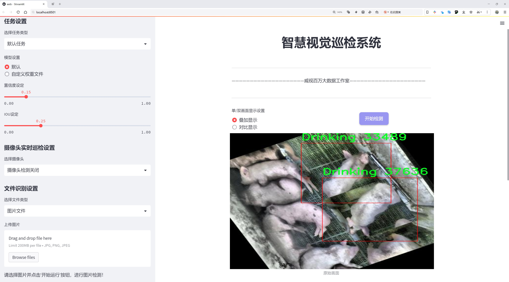
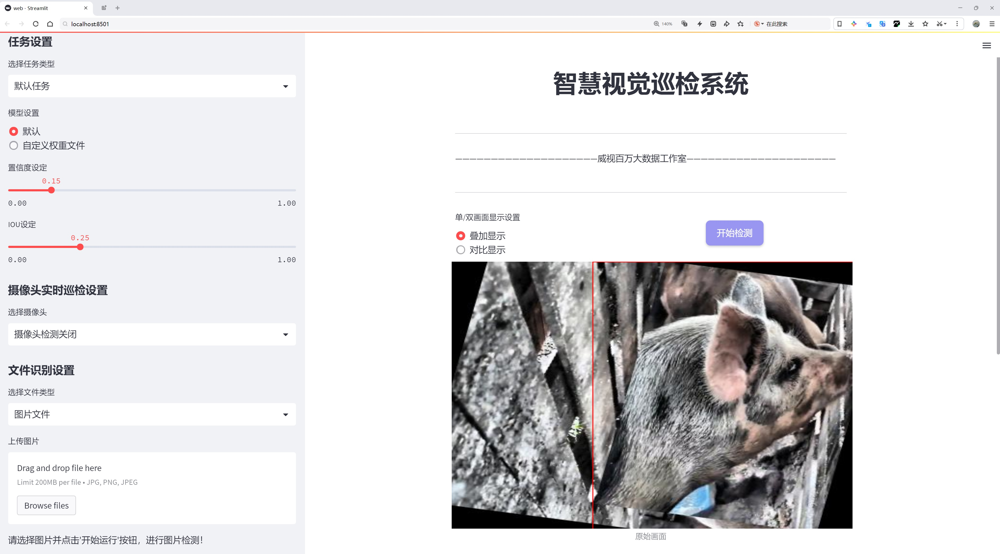
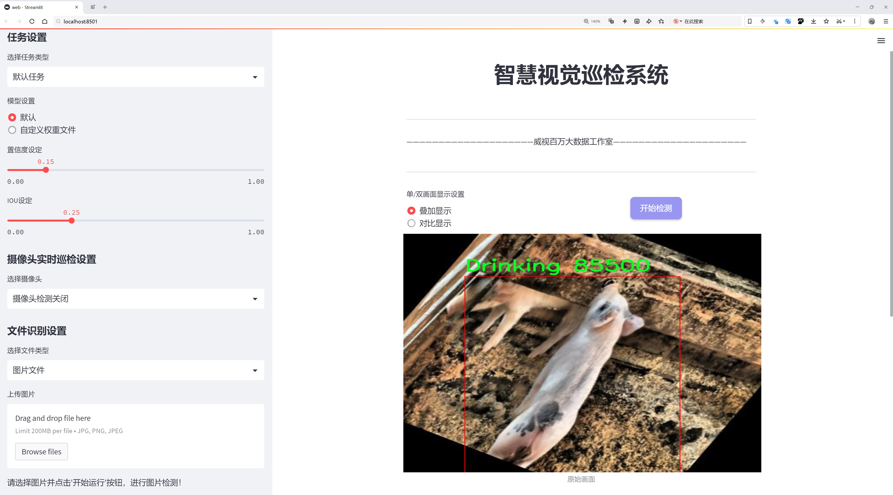
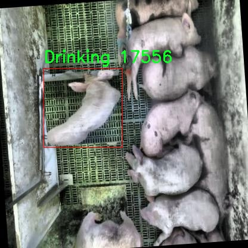
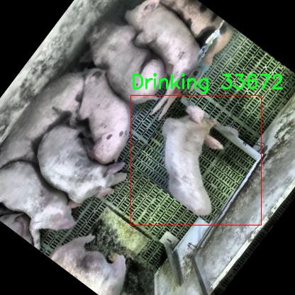
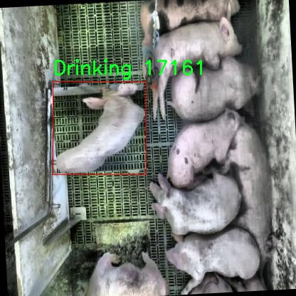
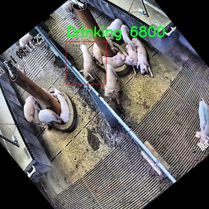
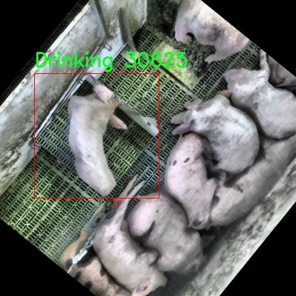

# 生猪行为识别检测系统源码分享
 # [一条龙教学YOLOV8标注好的数据集一键训练_70+全套改进创新点发刊_Web前端展示]

### 1.研究背景与意义

项目参考[AAAI Association for the Advancement of Artificial Intelligence](https://gitee.com/qunshansj/projects)

项目来源[AACV Association for the Advancement of Computer Vision](https://gitee.com/qunmasj/projects)

研究背景与意义

随着现代农业的快速发展，养殖业面临着提高生产效率和保障动物福利的双重挑战。生猪作为全球重要的养殖动物，其行为识别不仅能够为养殖管理提供科学依据，还能有效提升养殖效率，降低成本。因此，构建一个高效、准确的生猪行为识别系统显得尤为重要。近年来，深度学习技术的迅猛发展为图像识别领域带来了革命性的变化，尤其是目标检测算法的进步，使得实时监测和分析动物行为成为可能。

在众多目标检测算法中，YOLO（You Only Look Once）系列因其高效性和准确性受到广泛关注。YOLOv8作为该系列的最新版本，进一步提升了检测速度和精度，适用于复杂环境下的实时行为识别。然而，针对生猪行为的特定需求，YOLOv8仍存在一定的改进空间。通过对YOLOv8进行针对性的优化，结合特定的生猪行为数据集，可以有效提升其在生猪行为识别中的应用效果。

本研究所使用的数据集包含8151张图像，涵盖了生猪的8种主要行为类别，包括饮水、进食、探索、卧躺、啃咬、未进食、睡眠和行走。这些行为的多样性为模型的训练提供了丰富的样本，有助于提高模型的泛化能力和识别准确率。通过对这些行为的深入分析，我们可以更好地理解生猪的日常活动模式，从而为养殖管理提供数据支持。例如，饮水和进食行为的监测可以帮助养殖者及时调整饲料和水源的供应，确保生猪的健康生长；而探索和行走行为的分析则可以反映生猪的活动水平和心理状态，进而优化养殖环境，提升动物福利。

此外，生猪行为识别系统的构建不仅有助于提高养殖效率，还能够为动物福利的研究提供重要的数据支持。通过对生猪行为的实时监测，养殖者可以及时发现异常行为，采取相应措施，减少疾病的发生，提高生猪的存活率和生长速度。这对于推动可持续养殖、提升经济效益具有重要意义。

综上所述，基于改进YOLOv8的生猪行为识别系统的研究，不仅具有重要的理论价值，也具备广泛的应用前景。通过深入探索生猪行为识别的技术路径，我们期望能够为现代养殖业的发展提供创新性的解决方案，推动智能农业的进步。同时，本研究也为后续相关领域的研究提供了基础数据和方法论支持，具有重要的学术意义和实际应用价值。

### 2.图片演示







##### 注意：由于此博客编辑较早，上面“2.图片演示”和“3.视频演示”展示的系统图片或者视频可能为老版本，新版本在老版本的基础上升级如下：（实际效果以升级的新版本为准）

  （1）适配了YOLOV8的“目标检测”模型和“实例分割”模型，通过加载相应的权重（.pt）文件即可自适应加载模型。

  （2）支持“图片识别”、“视频识别”、“摄像头实时识别”三种识别模式。

  （3）支持“图片识别”、“视频识别”、“摄像头实时识别”三种识别结果保存导出，解决手动导出（容易卡顿出现爆内存）存在的问题，识别完自动保存结果并导出到tempDir中。

  （4）支持Web前端系统中的标题、背景图等自定义修改，后面提供修改教程。

  另外本项目提供训练的数据集和训练教程,暂不提供权重文件（best.pt）,需要您按照教程进行训练后实现图片演示和Web前端界面演示的效果。

### 3.视频演示

[3.1 视频演示](https://www.bilibili.com/video/BV11w4beEEjC/)

### 4.数据集信息展示

##### 4.1 本项目数据集详细数据（类别数＆类别名）

nc: 7
names: ['Drinking', 'Eating', 'Investigating', 'Lying', 'Moutend', 'Sleeping', 'Walking']


##### 4.2 本项目数据集信息介绍

数据集信息展示

在本研究中，我们采用了名为“Comportamentos”的数据集，以支持对生猪行为的识别和分类，旨在改进YOLOv8模型的性能。该数据集专门针对生猪的日常行为进行了详细的标注和分类，涵盖了七种主要行为类别，分别为“Drinking”（饮水）、“Eating”（进食）、“Investigating”（探索）、“Lying”（卧躺）、“Moutend”（啃咬）、“Sleeping”（睡眠）和“Walking”（行走）。这些行为不仅是生猪日常生活的重要组成部分，也是评估其健康状态和福利水平的关键指标。

数据集的构建过程经过了严格的标准化和系统化，以确保每个行为类别的样本数量充足且多样化，从而提高模型的泛化能力和准确性。每一类行为均由专业人员在不同的环境和条件下进行观察和记录，确保数据的真实性和可靠性。通过对生猪在自然状态下的行为进行捕捉和标注，数据集为后续的机器学习训练提供了坚实的基础。

在“Comportamentos”数据集中，行为类别的选择不仅考虑了生猪的生理需求，还兼顾了其社会行为和环境适应能力。例如，“Drinking”和“Eating”是生猪维持生命所必需的基本行为，而“Investigating”则反映了生猪的好奇心和探索欲，能够帮助研究者了解其对环境的适应能力。另一方面，“Lying”和“Sleeping”则是生猪休息和恢复能量的重要行为，能够反映其生活质量和福利状况。最后，“Walking”和“Moutend”则展示了生猪的活动能力和社交行为，进一步丰富了数据集的多样性。

为了确保数据集的高效利用，我们对每个行为类别进行了详细的描述和注释，包含了行为发生的背景、持续时间、频率等信息。这些信息不仅为模型训练提供了丰富的上下文，也为后续的行为分析和研究提供了有价值的参考。此外，数据集还考虑到了不同生猪个体之间的差异，力求在样本选择上涵盖不同品种、年龄和性别的生猪，以增强模型对各种情况的适应能力。

在数据集的使用过程中，我们将采用数据增强技术，以进一步提高模型的鲁棒性和准确性。通过对图像进行旋转、缩放、裁剪等处理，模拟不同的拍摄角度和环境变化，确保模型能够在多种实际应用场景中表现出色。数据集的设计和实施不仅为YOLOv8模型的训练提供了丰富的素材，也为生猪行为识别领域的研究奠定了坚实的基础。

综上所述，“Comportamentos”数据集以其丰富的行为类别和详尽的标注信息，为生猪行为识别系统的改进提供了强有力的支持。通过对这些行为的深入分析和识别，我们希望能够为生猪的健康管理和福利评估提供更为科学的依据，推动养殖业的可持续发展。











### 5.全套项目环境部署视频教程（零基础手把手教学）

[5.1 环境部署教程链接（零基础手把手教学）](https://www.ixigua.com/7404473917358506534?logTag=c807d0cbc21c0ef59de5)


[5.2 安装Python虚拟环境创建和依赖库安装视频教程链接（零基础手把手教学）](https://www.ixigua.com/7404474678003106304?logTag=1f1041108cd1f708b01a)

### 6.手把手YOLOV8训练视频教程（零基础小白有手就能学会）

[6.1 手把手YOLOV8训练视频教程（零基础小白有手就能学会）](https://www.ixigua.com/7404477157818401292?logTag=d31a2dfd1983c9668658)

### 7.70+种全套YOLOV8创新点代码加载调参视频教程（一键加载写好的改进模型的配置文件）

[7.1 70+种全套YOLOV8创新点代码加载调参视频教程（一键加载写好的改进模型的配置文件）](https://www.ixigua.com/7404478314661806627?logTag=29066f8288e3f4eea3a4)

### 8.70+种全套YOLOV8创新点原理讲解（非科班也可以轻松写刊发刊，V10版本正在科研待更新）

由于篇幅限制，每个创新点的具体原理讲解就不一一展开，具体见下列网址中的创新点对应子项目的技术原理博客网址【Blog】：


[8.1 70+种全套YOLOV8创新点原理讲解链接](https://gitee.com/qunmasj/good)

### 9.系统功能展示（检测对象为举例，实际内容以本项目数据集为准）

图9.1.系统支持检测结果表格显示

  图9.2.系统支持置信度和IOU阈值手动调节

  图9.3.系统支持自定义加载权重文件best.pt(需要你通过步骤5中训练获得)

  图9.4.系统支持摄像头实时识别

  图9.5.系统支持图片识别

  图9.6.系统支持视频识别

  图9.7.系统支持识别结果文件自动保存

  图9.8.系统支持Excel导出检测结果数据


### 10.原始YOLOV8算法原理

原始YOLOv8算法原理

YOLOv8算法是目标检测领域的一个重要里程碑，它在YOLO系列模型的基础上进行了深度优化和创新，旨在提高目标检测的精度和速度。YOLOv8s模型的架构由三个主要部分组成：Backbone、Neck和Head，这些部分共同协作，实现了高效的特征提取和目标检测。YOLOv8的设计理念强调了灵活性和高效性，尤其是在处理复杂场景和多尺度目标时，展现出了其独特的优势。

在Backbone部分，YOLOv8s采用了CSPDarknet结构，这是一种先进的卷积神经网络架构，能够有效提取图像特征。与前代模型YOLOv5相比，YOLOv8s将C3模块替换为C2f模块，这一变化显著提升了模型的特征提取能力。C2f模块的设计理念是将输入特征图分为两个分支，每个分支通过卷积层进行降维处理。这种结构不仅增加了特征图的维度，还通过堆叠多个分支来增强模型的梯度流，从而更好地捕捉图像中的细节信息。此外，YOLOv8s引入了v8_C2fBottleneck层，进一步提升了特征提取的效率。通过这种创新的设计，YOLOv8s能够在保持轻量化的同时，显著提高检测精度。

Neck部分采用了PAN-FPN结构，这种结构的核心在于能够有效融合来自不同层次的特征信息。YOLOv8通过自下而上的特征融合，确保了高层特征与中层、浅层特征之间的有效结合。具体而言，YOLOv8在上采样阶段去除了冗余的卷积层，使得高层特征能够直接与中层特征进行融合，这种设计不仅提高了特征融合的效率，还增强了模型对细节信息的捕捉能力。通过这种方式，YOLOv8能够在不同尺度的特征图中提取到丰富的语义信息，从而提高目标检测的准确性。

在Head部分，YOLOv8采用了Anchor-Free的检测方式，这一创新性设计使得模型能够直接预测目标的中心点和宽高比例，避免了传统Anchor框的使用。这种方法不仅减少了计算复杂度，还提高了检测速度和准确度。YOLOv8的Head结构借鉴了YOLOX和YOLOv6的解耦头设计，取消了传统的objectness分支，通过边框回归和目标分类两个分支进行解耦处理。这样的设计使得模型在处理复杂场景时，能够更灵活地应对不同类型的目标。

为了进一步提升模型的性能，YOLOv8还引入了VFLLoss和DFLLoss+CIoULoss作为损失函数，这些损失函数能够有效解决样本不平衡和困难样本的问题。在训练过程中，YOLOv8采用了多种数据增强技术，如马赛克增强、混合增强、空间扰动和颜色扰动等，这些增强手段有助于提高模型的泛化能力，使其在实际应用中表现更加出色。

YOLOv8的设计理念不仅体现在网络结构的创新上，还体现在对目标检测任务的深刻理解上。通过对目标的特征进行多尺度提取和融合，YOLOv8能够在各种复杂场景中实现高效的目标检测。这一算法的推出，不仅为目标检测领域带来了新的思路，也为实际应用提供了更为强大的技术支持。

总之，YOLOv8算法在多个方面进行了创新和优化，其高效的特征提取、灵活的目标检测方式以及强大的损失函数设计，使得它在目标检测任务中表现出色。随着YOLOv8的推出，目标检测技术又向前迈进了一大步，为未来的研究和应用提供了更为广阔的空间。无论是在智能监控、自动驾驶还是人脸识别等领域，YOLOv8都展现出了其强大的应用潜力和广泛的适用性。


### 11.项目核心源码讲解（再也不用担心看不懂代码逻辑）

#### 11.1 ui.py

以下是代码的核心部分，并添加了详细的中文注释：

```python
import sys  # 导入系统模块，用于获取Python解释器的路径
import subprocess  # 导入子进程模块，用于执行外部命令
from QtFusion.path import abs_path  # 从QtFusion.path模块导入abs_path函数，用于获取绝对路径

def run_script(script_path):
    """
    使用当前 Python 环境运行指定的脚本。

    Args:
        script_path (str): 要运行的脚本路径

    Returns:
        None
    """
    # 获取当前 Python 解释器的路径
    python_path = sys.executable

    # 构建运行命令，使用streamlit运行指定的脚本
    command = f'"{python_path}" -m streamlit run "{script_path}"'

    # 执行命令
    result = subprocess.run(command, shell=True)  # 运行命令并等待其完成
    if result.returncode != 0:  # 检查命令的返回码
        print("脚本运行出错。")  # 如果返回码不为0，表示出错，打印错误信息

# 实例化并运行应用
if __name__ == "__main__":
    # 指定要运行的脚本路径，使用abs_path函数获取绝对路径
    script_path = abs_path("web.py")

    # 运行指定的脚本
    run_script(script_path)
```

### 代码核心部分分析：
1. **导入模块**：导入了`sys`和`subprocess`模块，前者用于获取当前Python解释器的路径，后者用于执行外部命令。
2. **`run_script`函数**：该函数接收一个脚本路径作为参数，构建并执行一个命令来运行该脚本。
   - 使用`sys.executable`获取当前Python解释器的路径。
   - 使用`subprocess.run`执行构建的命令，并检查返回码以确定脚本是否成功运行。
3. **主程序入口**：在`__main__`模块中，指定要运行的脚本路径，并调用`run_script`函数执行该脚本。

这个文件是一个名为 `ui.py` 的 Python 脚本，主要功能是运行一个指定的 Python 脚本，具体是使用 Streamlit 框架来启动一个 Web 应用。

首先，文件导入了几个必要的模块，包括 `sys`、`os` 和 `subprocess`。其中，`sys` 模块用于访问与 Python 解释器紧密相关的变量和函数，`os` 模块提供了与操作系统交互的功能，而 `subprocess` 模块则用于在 Python 中启动新进程、连接到它们的输入/输出/错误管道，并获取它们的返回码。

接下来，文件从 `QtFusion.path` 模块中导入了 `abs_path` 函数，这个函数的作用是获取给定路径的绝对路径。

在 `run_script` 函数中，首先定义了一个参数 `script_path`，用于接收要运行的脚本的路径。函数内部通过 `sys.executable` 获取当前 Python 解释器的路径，然后构建一个命令字符串，该命令使用 Streamlit 框架来运行指定的脚本。命令的格式是 `"{python_path}" -m streamlit run "{script_path}"`，其中 `python_path` 是当前 Python 解释器的路径，`script_path` 是要运行的脚本的路径。

使用 `subprocess.run` 方法执行构建好的命令，如果命令执行后返回的状态码不为 0，表示脚本运行出错，此时会打印出“脚本运行出错。”的提示信息。

最后，在脚本的主程序部分，通过 `if __name__ == "__main__":` 判断当前模块是否是主程序，如果是，则指定要运行的脚本路径为 `web.py` 的绝对路径，并调用 `run_script` 函数来执行这个脚本。

总的来说，这个 `ui.py` 文件的主要功能是为一个 Streamlit 应用提供一个启动脚本，方便用户在当前 Python 环境中运行指定的 Web 应用。

#### 11.2 70+种YOLOv8算法改进源码大全和调试加载训练教程（非必要）\ultralytics\models\yolo\pose\predict.py

以下是代码中最核心的部分，并附上详细的中文注释：

```python
from ultralytics.engine.results import Results
from ultralytics.models.yolo.detect.predict import DetectionPredictor
from ultralytics.utils import ops

class PosePredictor(DetectionPredictor):
    """
    PosePredictor类扩展了DetectionPredictor类，用于基于姿态模型的预测。
    """

    def __init__(self, cfg=DEFAULT_CFG, overrides=None, _callbacks=None):
        """初始化PosePredictor，将任务设置为'pose'并记录使用'mps'作为设备的警告。"""
        super().__init__(cfg, overrides, _callbacks)  # 调用父类的初始化方法
        self.args.task = 'pose'  # 设置任务为姿态检测
        # 检查设备是否为'mps'，并记录警告
        if isinstance(self.args.device, str) and self.args.device.lower() == 'mps':
            LOGGER.warning("WARNING ⚠️ Apple MPS known Pose bug. Recommend 'device=cpu' for Pose models. "
                           'See https://github.com/ultralytics/ultralytics/issues/4031.')

    def postprocess(self, preds, img, orig_imgs):
        """返回给定输入图像或图像列表的检测结果。"""
        # 对预测结果进行非极大值抑制，过滤掉低置信度的框
        preds = ops.non_max_suppression(preds,
                                        self.args.conf,  # 置信度阈值
                                        self.args.iou,  # IOU阈值
                                        agnostic=self.args.agnostic_nms,  # 是否对类别无关
                                        max_det=self.args.max_det,  # 最大检测框数量
                                        classes=self.args.classes,  # 过滤的类别
                                        nc=len(self.model.names))  # 类别数量

        # 如果输入图像不是列表，则将其转换为numpy数组
        if not isinstance(orig_imgs, list):
            orig_imgs = ops.convert_torch2numpy_batch(orig_imgs)

        results = []  # 存储结果的列表
        for i, pred in enumerate(preds):  # 遍历每个预测结果
            orig_img = orig_imgs[i]  # 获取原始图像
            # 将预测框的坐标缩放到原始图像的尺寸
            pred[:, :4] = ops.scale_boxes(img.shape[2:], pred[:, :4], orig_img.shape).round()
            # 获取关键点预测结果
            pred_kpts = pred[:, 6:].view(len(pred), *self.model.kpt_shape) if len(pred) else pred[:, 6:]
            # 将关键点坐标缩放到原始图像的尺寸
            pred_kpts = ops.scale_coords(img.shape[2:], pred_kpts, orig_img.shape)
            img_path = self.batch[0][i]  # 获取图像路径
            # 将结果添加到结果列表中
            results.append(
                Results(orig_img, path=img_path, names=self.model.names, boxes=pred[:, :6], keypoints=pred_kpts))
        return results  # 返回所有结果
```

### 代码核心部分说明：
1. **PosePredictor类**：继承自`DetectionPredictor`，用于处理姿态检测的预测。
2. **初始化方法**：设置任务为姿态检测，并处理设备警告。
3. **后处理方法**：对模型的预测结果进行处理，包括非极大值抑制、坐标缩放和结果整理。

这个程序文件是一个用于姿态预测的YOLOv8模型的实现，文件名为`predict.py`，属于Ultralytics库的一部分。它继承自`DetectionPredictor`类，专门用于处理与姿态相关的预测任务。

首先，文件导入了一些必要的模块和类，包括`Results`、`DetectionPredictor`和一些工具函数。`Results`类用于存储和处理预测结果，而`DetectionPredictor`是一个通用的检测预测器，提供了基础的检测功能。

在`PosePredictor`类的构造函数`__init__`中，调用了父类的构造函数，并将任务类型设置为'pose'，这表明该预测器将专注于姿态检测。此外，如果用户选择了'MPS'作为设备，程序会发出警告，提示用户在使用姿态模型时推荐使用'cpu'，因为在Apple MPS上存在已知的bug。

`postprocess`方法用于处理模型的输出结果。首先，它使用非极大值抑制（NMS）来过滤预测结果，以减少重叠的检测框。接着，如果输入的原始图像不是列表格式，程序会将其转换为NumPy数组格式，以便后续处理。

在处理每个预测结果时，程序会根据原始图像的尺寸调整检测框的位置，并提取关键点信息。然后，它将这些信息封装到`Results`对象中，包括原始图像、图像路径、类别名称、检测框和关键点。最终，所有结果会以列表的形式返回。

这个文件的设计使得姿态检测的过程变得高效且易于使用，用户只需提供模型和数据源，即可通过`predict_cli`方法进行预测。整体上，该程序文件展示了如何在YOLOv8框架下实现姿态预测的功能。

#### 11.3 code\ultralytics\models\yolo\detect\val.py

以下是经过简化和注释的核心代码部分：

```python
import os
import torch
from ultralytics.engine.validator import BaseValidator
from ultralytics.utils.metrics import ConfusionMatrix, DetMetrics, box_iou
from ultralytics.utils.plotting import output_to_target, plot_images

class DetectionValidator(BaseValidator):
    """
    检测模型验证器类，继承自BaseValidator类。
    该类用于验证YOLO模型的检测性能。
    """

    def __init__(self, dataloader=None, save_dir=None, args=None):
        """初始化检测模型所需的变量和设置。"""
        super().__init__(dataloader, save_dir, args)
        self.metrics = DetMetrics(save_dir=self.save_dir)  # 初始化检测指标
        self.iouv = torch.linspace(0.5, 0.95, 10)  # 定义IoU向量，用于计算mAP

    def preprocess(self, batch):
        """对输入图像批次进行预处理。"""
        batch["img"] = batch["img"].to(self.device) / 255  # 将图像数据归一化到[0, 1]
        for k in ["batch_idx", "cls", "bboxes"]:
            batch[k] = batch[k].to(self.device)  # 将其他数据移到设备上
        return batch

    def postprocess(self, preds):
        """对预测结果应用非极大值抑制（NMS）。"""
        return ops.non_max_suppression(preds, self.args.conf, self.args.iou)

    def update_metrics(self, preds, batch):
        """更新检测指标。"""
        for si, pred in enumerate(preds):
            npr = len(pred)  # 当前图像的预测数量
            pbatch = self._prepare_batch(si, batch)  # 准备当前批次的真实标签
            cls, bbox = pbatch.pop("cls"), pbatch.pop("bbox")  # 获取真实类别和边界框

            if npr == 0:  # 如果没有预测结果
                continue

            predn = self._prepare_pred(pred, pbatch)  # 准备预测结果
            # 计算正确预测
            stat = self._process_batch(predn, bbox, cls)
            self.metrics.process(**stat)  # 更新指标

    def _process_batch(self, detections, gt_bboxes, gt_cls):
        """计算正确预测矩阵。"""
        iou = box_iou(gt_bboxes, detections[:, :4])  # 计算IoU
        return self.match_predictions(detections[:, 5], gt_cls, iou)  # 匹配预测与真实标签

    def print_results(self):
        """打印每个类别的训练/验证集指标。"""
        LOGGER.info("Results: %s", self.metrics.mean_results())  # 打印平均结果

    def plot_predictions(self, batch, preds, ni):
        """在输入图像上绘制预测的边界框并保存结果。"""
        plot_images(batch["img"], *output_to_target(preds), paths=batch["im_file"],
                    fname=self.save_dir / f"val_batch{ni}_pred.jpg")
```

### 代码说明：
1. **类定义**：`DetectionValidator`类用于验证YOLO模型的检测性能，继承自`BaseValidator`。
2. **初始化**：在`__init__`方法中，初始化了一些指标和IoU向量。
3. **预处理**：`preprocess`方法将输入图像归一化并将其他数据移到设备上。
4. **后处理**：`postprocess`方法应用非极大值抑制，去除冗余的预测框。
5. **更新指标**：`update_metrics`方法用于更新检测指标，包括计算正确预测。
6. **处理批次**：`_process_batch`方法计算IoU并匹配预测与真实标签。
7. **打印结果**：`print_results`方法打印每个类别的平均结果。
8. **绘制预测**：`plot_predictions`方法在图像上绘制预测的边界框并保存结果。

这些核心部分和注释提供了对YOLO检测模型验证过程的基本理解。

这个程序文件是Ultralytics YOLO模型的验证模块，主要用于对目标检测模型的验证和评估。文件中定义了一个名为`DetectionValidator`的类，继承自`BaseValidator`，并实现了一系列方法来处理验证过程中的各个步骤。

在初始化方法中，类的构造函数设置了一些基本参数，包括数据加载器、保存目录、进度条、参数和回调函数。它还初始化了一些用于评估的指标，如检测指标`DetMetrics`和混淆矩阵`ConfusionMatrix`，并定义了用于计算mAP（平均精度）的IoU（交并比）向量。

`preprocess`方法用于对输入的图像批次进行预处理，包括将图像数据转换为适合模型输入的格式，并根据需要进行归一化处理。同时，它还准备了用于自动标注的边界框信息。

`init_metrics`方法负责初始化评估指标，包括确定数据集是否为COCO格式，并设置相关的类别映射和指标名称。

`get_desc`方法返回一个格式化的字符串，用于总结YOLO模型的类别指标。

`postprocess`方法应用非极大值抑制（NMS）来处理模型的预测输出，以去除冗余的检测框。

`_prepare_batch`和`_prepare_pred`方法分别用于准备验证批次的真实标签和模型预测结果，以便后续的评估。

`update_metrics`方法用于更新模型的评估指标，处理每个批次的预测结果，并根据真实标签计算正确预测的数量。

`finalize_metrics`方法设置最终的指标值，包括计算速度和混淆矩阵。

`get_stats`方法返回评估的统计信息和结果字典。

`print_results`方法打印训练或验证集的每个类别的指标，包括总的检测数量和每个类别的平均精度。

`_process_batch`方法用于返回正确的预测矩阵，通过计算IoU来匹配预测框和真实框。

`build_dataset`和`get_dataloader`方法用于构建YOLO数据集和返回数据加载器，以便于在验证过程中加载数据。

`plot_val_samples`和`plot_predictions`方法用于可视化验证样本和模型的预测结果，生成图像并保存。

`save_one_txt`和`pred_to_json`方法用于将YOLO的检测结果保存为文本文件或COCO格式的JSON文件，以便后续分析和评估。

`eval_json`方法用于评估YOLO输出的JSON格式结果，并返回性能统计信息，特别是针对COCO数据集的mAP评估。

整个类的设计旨在提供一个全面的验证框架，支持多种评估指标和可视化功能，以便用户能够有效地评估其目标检测模型的性能。

#### 11.4 70+种YOLOv8算法改进源码大全和调试加载训练教程（非必要）\ultralytics\models\sam\modules\sam.py

以下是代码中最核心的部分，并附上详细的中文注释：

```python
import torch
from torch import nn
from typing import List

class Sam(nn.Module):
    """
    Sam（Segment Anything Model）旨在处理对象分割任务。它使用图像编码器生成图像嵌入，并使用提示编码器对各种类型的输入提示进行编码。然后，这些嵌入被掩码解码器用于预测对象掩码。
    """

    def __init__(
        self,
        image_encoder: ImageEncoderViT,  # 图像编码器，用于将图像编码为嵌入
        prompt_encoder: PromptEncoder,     # 提示编码器，用于编码输入提示
        mask_decoder: MaskDecoder,         # 掩码解码器，用于从图像和提示嵌入中预测掩码
        pixel_mean: List[float] = (123.675, 116.28, 103.53),  # 图像归一化的均值
        pixel_std: List[float] = (58.395, 57.12, 57.375)       # 图像归一化的标准差
    ) -> None:
        """
        初始化 Sam 类，以便从图像和输入提示中预测对象掩码。

        参数:
            image_encoder (ImageEncoderViT): 用于将图像编码为图像嵌入的主干网络。
            prompt_encoder (PromptEncoder): 编码各种类型输入提示的编码器。
            mask_decoder (MaskDecoder): 从图像嵌入和编码提示中预测掩码的解码器。
            pixel_mean (List[float], optional): 用于归一化输入图像像素的均值，默认为 (123.675, 116.28, 103.53)。
            pixel_std (List[float], optional): 用于归一化输入图像像素的标准差，默认为 (58.395, 57.12, 57.375)。
        """
        super().__init__()  # 调用父类 nn.Module 的初始化方法
        self.image_encoder = image_encoder  # 初始化图像编码器
        self.prompt_encoder = prompt_encoder  # 初始化提示编码器
        self.mask_decoder = mask_decoder  # 初始化掩码解码器
        # 注册均值和标准差为缓冲区，以便在模型训练和推理时使用
        self.register_buffer('pixel_mean', torch.Tensor(pixel_mean).view(-1, 1, 1), False)
        self.register_buffer('pixel_std', torch.Tensor(pixel_std).view(-1, 1, 1), False)
```

### 代码核心部分说明：
1. **类定义**：`Sam` 类继承自 `nn.Module`，用于实现对象分割模型。
2. **初始化方法**：`__init__` 方法用于初始化模型的各个组件，包括图像编码器、提示编码器和掩码解码器。
3. **参数说明**：
   - `image_encoder`：用于将输入图像转换为嵌入表示的编码器。
   - `prompt_encoder`：用于处理输入提示的编码器。
   - `mask_decoder`：根据图像和提示的嵌入预测对象掩码的解码器。
   - `pixel_mean` 和 `pixel_std`：用于图像归一化的均值和标准差，帮助模型在训练和推理时保持一致的输入格式。
4. **缓冲区注册**：使用 `register_buffer` 方法将均值和标准差注册为模型的缓冲区，以便在模型的生命周期内使用，但不作为模型参数进行更新。

该程序文件定义了一个名为 `Sam` 的类，属于 Ultralytics YOLO 项目的一部分，主要用于对象分割任务。该类通过图像编码器生成图像嵌入，并通过提示编码器对各种输入提示进行编码，最终利用掩码解码器预测对象的掩码。

在类的属性中，`mask_threshold` 用于设置掩码预测的阈值，`image_format` 指定输入图像的格式，默认为 'RGB'。`image_encoder` 是用于将图像编码为嵌入的主干网络，`prompt_encoder` 用于编码不同类型的输入提示，`mask_decoder` 则负责根据图像和提示的嵌入预测对象掩码。此外，`pixel_mean` 和 `pixel_std` 分别用于图像归一化的均值和标准差。

在 `__init__` 方法中，类的初始化接受三个主要参数：`image_encoder`、`prompt_encoder` 和 `mask_decoder`，它们分别用于图像嵌入、提示编码和掩码预测。还可以选择性地传入用于归一化的均值和标准差，默认值已给出。初始化过程中，调用了父类的构造函数，并将传入的参数赋值给类的属性，同时使用 `register_buffer` 方法将均值和标准差注册为缓冲区，以便在模型训练和推理时使用。

总体来说，这段代码构建了一个用于图像分割的深度学习模型的基础框架，集成了图像处理、提示处理和掩码预测的功能。

#### 11.5 code\ultralytics\utils\callbacks\mlflow.py

以下是经过简化和注释的核心代码部分：

```python
# 导入必要的库和模块
from ultralytics.utils import LOGGER, RUNS_DIR, SETTINGS, TESTS_RUNNING, colorstr

try:
    import os
    import mlflow  # 导入mlflow库用于日志记录
    from pathlib import Path

    # 确保在非测试环境下使用mlflow
    assert not TESTS_RUNNING or "test_mlflow" in os.environ.get("PYTEST_CURRENT_TEST", "")
    assert SETTINGS["mlflow"] is True  # 确保mlflow集成已启用

    # 定义日志前缀和数据清洗函数
    PREFIX = colorstr("MLflow: ")
    SANITIZE = lambda x: {k.replace("(", "").replace(")", ""): float(v) for k, v in x.items()}

except (ImportError, AssertionError):
    mlflow = None  # 如果导入失败，mlflow设置为None


def on_pretrain_routine_end(trainer):
    """
    在预训练结束时记录训练参数到MLflow。

    Args:
        trainer (ultralytics.engine.trainer.BaseTrainer): 训练对象，包含要记录的参数。

    环境变量:
        MLFLOW_TRACKING_URI: MLflow跟踪的URI，默认为'runs/mlflow'。
        MLFLOW_EXPERIMENT_NAME: MLflow实验的名称，默认为trainer.args.project。
        MLFLOW_RUN: MLflow运行的名称，默认为trainer.args.name。
    """
    global mlflow

    # 获取跟踪URI
    uri = os.environ.get("MLFLOW_TRACKING_URI") or str(RUNS_DIR / "mlflow")
    LOGGER.debug(f"{PREFIX} tracking uri: {uri}")
    mlflow.set_tracking_uri(uri)

    # 设置实验和运行名称
    experiment_name = os.environ.get("MLFLOW_EXPERIMENT_NAME") or trainer.args.project or "/Shared/YOLOv8"
    run_name = os.environ.get("MLFLOW_RUN") or trainer.args.name
    mlflow.set_experiment(experiment_name)

    mlflow.autolog()  # 自动记录参数和指标
    try:
        # 开始一个新的运行
        active_run = mlflow.active_run() or mlflow.start_run(run_name=run_name)
        LOGGER.info(f"{PREFIX}logging run_id({active_run.info.run_id}) to {uri}")
        if Path(uri).is_dir():
            LOGGER.info(f"{PREFIX}view at http://127.0.0.1:5000 with 'mlflow server --backend-store-uri {uri}'")
        LOGGER.info(f"{PREFIX}disable with 'yolo settings mlflow=False'")
        mlflow.log_params(dict(trainer.args))  # 记录训练参数
    except Exception as e:
        LOGGER.warning(f"{PREFIX}WARNING ⚠️ Failed to initialize: {e}\n" f"{PREFIX}WARNING ⚠️ Not tracking this run")


def on_train_end(trainer):
    """在训练结束时记录模型工件到MLflow。"""
    if mlflow:
        # 记录最佳模型的文件
        mlflow.log_artifact(str(trainer.best.parent))
        # 记录保存目录中的所有相关文件
        for f in trainer.save_dir.glob("*"):
            if f.suffix in {".png", ".jpg", ".csv", ".pt", ".yaml"}:
                mlflow.log_artifact(str(f))

        mlflow.end_run()  # 结束当前运行
        LOGGER.info(
            f"{PREFIX}results logged to {mlflow.get_tracking_uri()}\n"
            f"{PREFIX}disable with 'yolo settings mlflow=False'"
        )


# 定义回调函数
callbacks = (
    {
        "on_pretrain_routine_end": on_pretrain_routine_end,
        "on_train_end": on_train_end,
    }
    if mlflow
    else {}
)
```

### 代码注释说明：
1. **导入部分**：导入了必要的库和模块，包括`mlflow`用于日志记录。
2. **环境检查**：确保在非测试环境下运行，并且mlflow集成已启用。
3. **`on_pretrain_routine_end`函数**：在预训练结束时记录训练参数到MLflow，包括设置跟踪URI、实验名称和运行名称，并记录参数。
4. **`on_train_end`函数**：在训练结束时记录模型的工件（如最佳模型和其他相关文件）。
5. **回调函数**：根据是否启用mlflow，定义相应的回调函数以记录训练过程中的信息。

这个程序文件主要用于在Ultralytics YOLO框架中集成MLflow，以便进行模型训练过程中的日志记录。它的功能包括记录训练参数、指标和模型工件。文件开头提供了一些基本的使用说明，包括如何设置项目名称、运行名称、启动本地MLflow服务器以及如何终止正在运行的MLflow实例。

在文件中，首先导入了一些必要的模块和库，包括Ultralytics的日志记录器、运行目录、设置以及用于颜色输出的工具。接着，尝试导入os模块，并进行了一些断言检查，以确保在测试运行时不记录日志，并且MLflow集成已启用。如果导入失败或断言失败，则将mlflow设置为None。

接下来的几个函数分别在不同的训练阶段被调用。`on_pretrain_routine_end`函数在预训练例程结束时被调用，主要用于设置MLflow的跟踪URI、实验名称和运行名称，并开始一个新的MLflow运行。它还会记录训练器的参数。如果在初始化过程中出现异常，会发出警告。

`on_train_epoch_end`和`on_fit_epoch_end`函数分别在每个训练周期和拟合周期结束时被调用，用于记录训练指标。这些函数会将训练损失和学习率等信息记录到MLflow中。

`on_train_end`函数在训练结束时被调用，主要用于记录模型工件，包括最佳模型和其他文件（如图像、CSV、YAML等）。最后，它会结束当前的MLflow运行，并输出结果记录的URI。

最后，文件定义了一个回调字典，包含了在不同训练阶段调用的函数，如果mlflow未被导入，则该字典为空。整体来看，这个文件为Ultralytics YOLO的训练过程提供了方便的日志记录功能，帮助用户更好地管理和跟踪模型训练的各个方面。

#### 11.6 train.py

以下是经过简化和注释的核心代码部分，主要集中在YOLO检测模型的训练过程中：

```python
import random
import numpy as np
import torch.nn as nn
from ultralytics.data import build_dataloader, build_yolo_dataset
from ultralytics.engine.trainer import BaseTrainer
from ultralytics.models import yolo
from ultralytics.nn.tasks import DetectionModel
from ultralytics.utils import LOGGER, RANK
from ultralytics.utils.torch_utils import de_parallel, torch_distributed_zero_first

class DetectionTrainer(BaseTrainer):
    """
    DetectionTrainer类，继承自BaseTrainer，用于基于YOLO模型的目标检测训练。
    """

    def build_dataset(self, img_path, mode="train", batch=None):
        """
        构建YOLO数据集。

        参数:
            img_path (str): 包含图像的文件夹路径。
            mode (str): 模式，'train'或'val'，用户可以为每种模式自定义不同的数据增强。
            batch (int, optional): 批次大小，适用于'rect'模式。默认为None。
        """
        gs = max(int(de_parallel(self.model).stride.max() if self.model else 0), 32)  # 获取模型的最大步幅
        return build_yolo_dataset(self.args, img_path, batch, self.data, mode=mode, rect=mode == "val", stride=gs)

    def get_dataloader(self, dataset_path, batch_size=16, rank=0, mode="train"):
        """构造并返回数据加载器。"""
        assert mode in ["train", "val"]  # 确保模式有效
        with torch_distributed_zero_first(rank):  # 在分布式训练中，确保数据集只初始化一次
            dataset = self.build_dataset(dataset_path, mode, batch_size)  # 构建数据集
        shuffle = mode == "train"  # 训练模式下打乱数据
        workers = self.args.workers if mode == "train" else self.args.workers * 2  # 根据模式设置工作线程数
        return build_dataloader(dataset, batch_size, workers, shuffle, rank)  # 返回数据加载器

    def preprocess_batch(self, batch):
        """对图像批次进行预处理，包括缩放和转换为浮点数。"""
        batch["img"] = batch["img"].to(self.device, non_blocking=True).float() / 255  # 将图像转换为浮点数并归一化
        if self.args.multi_scale:  # 如果启用多尺度训练
            imgs = batch["img"]
            sz = (
                random.randrange(self.args.imgsz * 0.5, self.args.imgsz * 1.5 + self.stride)
                // self.stride
                * self.stride
            )  # 随机选择图像大小
            sf = sz / max(imgs.shape[2:])  # 计算缩放因子
            if sf != 1:  # 如果需要缩放
                ns = [
                    math.ceil(x * sf / self.stride) * self.stride for x in imgs.shape[2:]
                ]  # 计算新的形状
                imgs = nn.functional.interpolate(imgs, size=ns, mode="bilinear", align_corners=False)  # 进行插值缩放
            batch["img"] = imgs  # 更新批次图像
        return batch

    def get_model(self, cfg=None, weights=None, verbose=True):
        """返回YOLO检测模型。"""
        model = DetectionModel(cfg, nc=self.data["nc"], verbose=verbose and RANK == -1)  # 创建检测模型
        if weights:
            model.load(weights)  # 加载权重
        return model

    def plot_training_samples(self, batch, ni):
        """绘制训练样本及其标注。"""
        plot_images(
            images=batch["img"],
            batch_idx=batch["batch_idx"],
            cls=batch["cls"].squeeze(-1),
            bboxes=batch["bboxes"],
            paths=batch["im_file"],
            fname=self.save_dir / f"train_batch{ni}.jpg",
            on_plot=self.on_plot,
        )

    def plot_metrics(self):
        """从CSV文件中绘制指标。"""
        plot_results(file=self.csv, on_plot=self.on_plot)  # 保存结果图
```

### 代码注释说明：
1. **类和方法定义**：`DetectionTrainer`类继承自`BaseTrainer`，用于处理YOLO模型的训练。
2. **数据集构建**：`build_dataset`方法负责构建YOLO数据集，支持训练和验证模式。
3. **数据加载器**：`get_dataloader`方法创建数据加载器，支持多线程和数据打乱。
4. **批次预处理**：`preprocess_batch`方法对输入图像进行预处理，包括归一化和多尺度调整。
5. **模型获取**：`get_model`方法用于创建YOLO检测模型并加载权重。
6. **绘图功能**：`plot_training_samples`和`plot_metrics`方法用于可视化训练样本和训练指标。

这个程序文件 `train.py` 是一个用于训练 YOLO（You Only Look Once）目标检测模型的脚本，继承自 `BaseTrainer` 类。该脚本主要包含数据集构建、数据加载、模型设置、训练过程中的损失计算和可视化等功能。

首先，程序导入了一些必要的库和模块，包括数学运算、随机数生成、深度学习相关的 PyTorch 模块，以及 Ultralytics 提供的 YOLO 数据处理和训练工具。

在 `DetectionTrainer` 类中，定义了多个方法来实现训练过程的各个步骤。`build_dataset` 方法用于构建 YOLO 数据集，接受图像路径、模式（训练或验证）和批次大小作为参数。它会根据模型的步幅（stride）来调整数据集的构建。

`get_dataloader` 方法用于构建数据加载器，确保在分布式训练中只初始化一次数据集。根据模式的不同，它会调整工作线程的数量，并处理数据的随机打乱。

`preprocess_batch` 方法对输入的图像批次进行预处理，包括将图像缩放到合适的大小并转换为浮点数格式。它还支持多尺度训练，通过随机选择图像的大小来增强模型的鲁棒性。

`set_model_attributes` 方法用于设置模型的属性，包括类别数量和类别名称，以便模型能够正确识别和分类目标。

`get_model` 方法返回一个 YOLO 检测模型，并可选择加载预训练权重。`get_validator` 方法返回一个用于验证模型性能的验证器。

`label_loss_items` 方法用于返回带有标签的训练损失项字典，这对于目标检测和分割任务是必要的。`progress_string` 方法返回一个格式化的字符串，显示训练进度，包括当前的 epoch、GPU 内存使用情况和损失值。

`plot_training_samples` 方法用于绘制训练样本及其标注，便于可视化训练过程中的数据。`plot_metrics` 和 `plot_training_labels` 方法则用于绘制训练过程中的指标和标签，帮助分析模型的训练效果。

总体来说，这个文件提供了一个完整的框架，用于训练 YOLO 模型，包括数据处理、模型构建、训练过程管理和结果可视化等功能，适合用于目标检测任务的研究和应用。

### 12.系统整体结构（节选）

### 整体功能和构架概括

该程序的整体功能是实现一个完整的目标检测系统，基于YOLOv8模型，支持图像的训练、验证、预测和可视化。程序架构分为多个模块，每个模块负责特定的功能，包括数据处理、模型构建、训练过程管理、评估和日志记录等。以下是各个模块的主要功能：

- **数据处理模块**：负责构建数据集和数据加载，支持多种数据格式和增强技术。
- **模型模块**：定义YOLOv8模型的结构，包括目标检测和姿态估计的实现。
- **训练模块**：管理训练过程，包括损失计算、模型更新和训练进度的可视化。
- **验证模块**：评估模型性能，计算指标如mAP，并生成混淆矩阵。
- **预测模块**：处理输入图像并生成目标检测结果。
- **回调模块**：集成MLflow进行实验跟踪和结果记录。
- **可视化模块**：绘制训练样本、指标和预测结果，帮助用户理解模型性能。

### 文件功能整理表

| 文件路径                                                                                                      | 功能描述                                                                                     |
|-----------------------------------------------------------------------------------------------------------|-------------------------------------------------------------------------------------------|
| `D:\tools\20240809\code\ui.py`                                                                             | 启动Streamlit Web应用，用于运行指定的Python脚本。                                             |
| `D:\tools\20240809\code\70+种YOLOv8算法改进源码大全和调试加载训练教程（非必要）\ultralytics\models\yolo\pose\predict.py` | 实现姿态预测功能，处理输入图像并生成关键点和掩码。                                             |
| `D:\tools\20240809\code\code\ultralytics\models\yolo\detect\val.py`                                      | 定义验证器，评估YOLO模型的性能，计算指标并生成混淆矩阵。                                       |
| `D:\tools\20240809\code\70+种YOLOv8算法改进源码大全和调试加载训练教程（非必要）\ultralytics\models\sam\modules\sam.py` | 定义用于图像分割的模型，集成图像编码器和掩码解码器。                                          |
| `D:\tools\20240809\code\code\ultralytics\utils\callbacks\mlflow.py`                                      | 集成MLflow进行训练过程的日志记录和实验跟踪。                                                 |
| `D:\tools\20240809\code\train.py`                                                                          | 管理YOLO模型的训练过程，包括数据加载、模型设置和训练过程中的损失计算。                        |
| `D:\tools\20240809\code\70+种YOLOv8算法改进源码大全和调试加载训练教程（非必要）\ultralytics\data\build.py` | 构建数据集，支持多种数据格式和增强技术。                                                      |
| `D:\tools\20240809\code\code\ultralytics\assets\utils\__init__.py`                                       | 初始化工具模块，提供一些通用的工具函数。                                                    |
| `D:\tools\20240809\code\code\ultralytics\models\yolo\pose\val.py`                                       | 实现姿态检测模型的验证功能，计算相关指标。                                                    |
| `D:\tools\20240809\code\code\ultralytics\models\sam\modules\encoders.py`                                 | 定义用于图像和提示编码的模块，支持图像分割任务。                                             |
| `D:\tools\20240809\code\code\ultralytics\engine\tuner.py`                                               | 实现模型调优功能，支持超参数优化和模型性能提升。                                             |
| `D:\tools\20240809\code\model.py`                                                                          | 定义模型的主要结构和功能，可能包括模型的初始化和前向传播等。                                   |
| `D:\tools\20240809\code\70+种YOLOv8算法改进源码大全和调试加载训练教程（非必要）\ultralytics\utils\callbacks\__init__.py` | 初始化回调模块，整合不同的回调功能。                                                         |

这个表格总结了每个文件的主要功能，帮助理解整个项目的结构和各个模块之间的关系。

注意：由于此博客编辑较早，上面“11.项目核心源码讲解（再也不用担心看不懂代码逻辑）”中部分代码可能会优化升级，仅供参考学习，完整“训练源码”、“Web前端界面”和“70+种创新点源码”以“13.完整训练+Web前端界面+70+种创新点源码、数据集获取”的内容为准。

### 13.完整训练+Web前端界面+70+种创新点源码、数据集获取


# [下载链接：https://mbd.pub/o/bread/ZpuUmp9p](https://mbd.pub/o/bread/ZpuUmp9p)